<picture>
  <source media="(prefers-color-scheme: dark)" srcset="dist/defense-dark.svg">
  
</picture>

generated with <a href="https://github.com/rim95dev/contribution-defense">rim95dev/contribution-defense</a>
